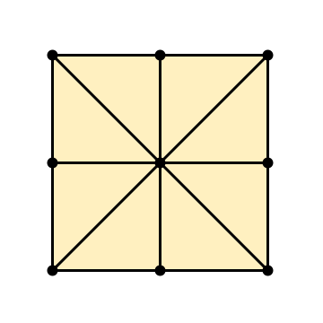
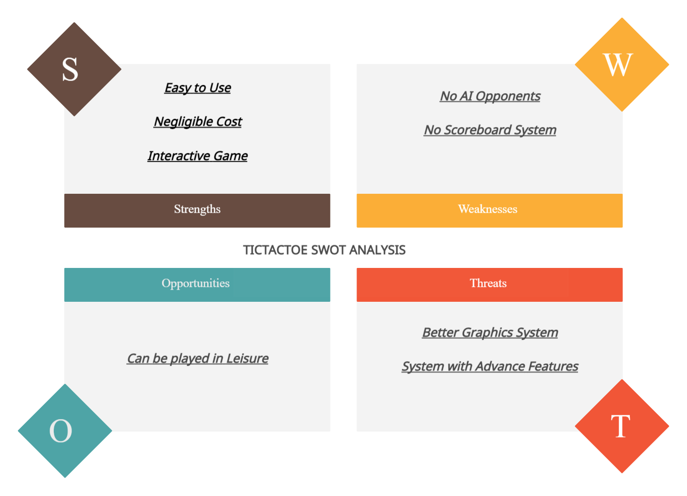

# **Requirements**

## **Introduction**

Tic-tac-toe also known as Noughts and Crosses or Xs and Os, is a paper-and-pencil game for two players, where one player chooses X and other chooses O, take turns marking the spaces in a 3x3 grid. The player who succeeds in placing three of their marks in a pattern i.e., diagonal, horizontal or vertical row is the winner. It is a solved game with a forced draw assuming the best play form both players. Players soon discover that the best play from both parties leads to a draw. Hence, tic-tac-toe is most often played by young children, who often have not yet discovered the optimal strategy.

## **History**

An early variation of tic-tac-toe was played in the Roman Empire, around the first century BC. It was called *terni laplilli* and instead of having any number of pieces, each player only had three, thus they had to move them around to empty spaces to keep playing. The game's grid markings have been found chalked all over Rome. Another closely related ancient game is three men’s morris which is also played on a smiple grid and requires three pieces in a row to finish.

### **SWOT Analysis**

## **4 W and 1 H:**

## **Who:**

  Anyone

## **What:**

  This project will act as automated tictactoe board where player can mark Xs and Os.

  As a brain Teaser for Kids

## **When:**

  This project can be used during leisure and to pass time.
  
## **Where:**

  This project can be implemented anywhere.

## **How:**

  This Project will require two players and will take input in form of Xs and Os and perform operations based on player choice, depending on which a player may win or game will end in a draw.

## High Level Requirements:

| ID | Description |
| ----- | ----- |
| HR1 | Player 1 Lose/Win |
| HR2 | Player 2 Lose/Win |
| HR3 | Game Ends in a Draw |

## Low Level Requirements:

| ID | Description | HLR ID |
| ----- | ----- | ----- |
| LR1 | Player 1 plays with 'X'| HR1 |
| LR2 | Player 2 plays with 'O' | HR1 |
| LR3 | Player 1 gets the First Turn | HR2 |
| LR4 | Playyer 2 gets the Second Turn | HR2 |
| LR5 | If Player 1 gets 3 Xs in vertical, horizontal or diagonal row, Player 2 will lose.| HR3 |
| LR6 | If Player 2 gets 3 Os in vertical, horizontal or diagonal row, Player 2 will lose. | HR3 |
| LR7 | If all the turns are complete and no one wins, Game ends in a draw| HR3 |
